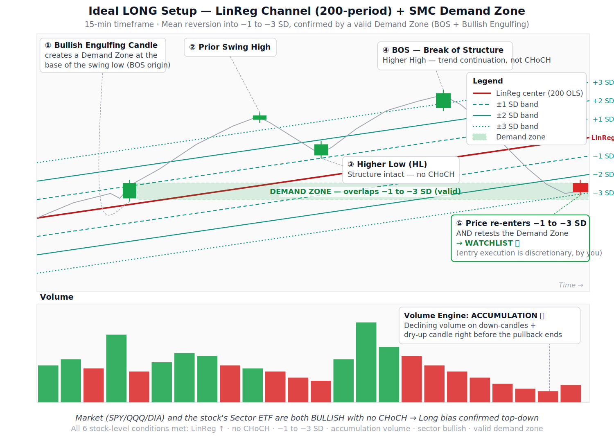
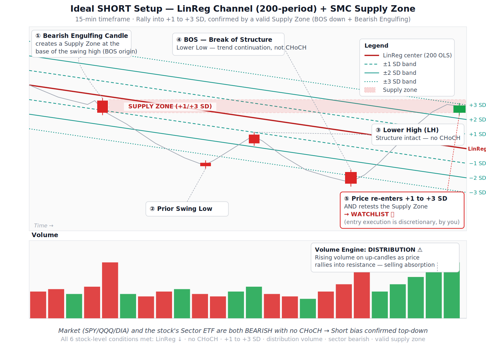

# Eagle Logic System — Daily Stock Scanner

An automated, ML-ranked technical screener for US equities, combining a
rules-based trend/structure waterfall with a calibrated machine learning
model to surface high-conviction daily trade candidates — deployed
entirely on free-tier cloud infrastructure.

---

## 1. Problem Statement

Manually screening thousands of US-listed stocks every day for technically
sound setups is slow, inconsistent, and difficult to apply with discipline.
A trader relying on manual review will:

- Miss setups simply due to time constraints across a large universe
- Apply screening criteria inconsistently from day to day
- Struggle to objectively rank *which* of many valid-looking setups is
  actually the strongest, rather than just which ones technically qualify

At the same time, purely rules-based automated screeners (fixed technical
filters with no learning component) treat every qualifying setup as
equally good — they can tell you a stock passed a set of conditions, but
not how likely that specific setup is to actually succeed, or how it
compares against everything else evaluated that day.

This project addresses both problems: a fully automated daily pipeline
that (1) narrows the entire US equity universe down to technically valid
candidates via a systematic, top-down waterfall, and (2) uses a machine
learning model — trained and validated with genuine forward-looking
rigor — to rank those candidates by calibrated probability of success,
so the highest-conviction ideas surface to the top.

## 2. Project Objectives

- **Automate** daily technical screening across the full US equity
  universe (~5,000–6,000 tickers), with no manual review step required
- **Combine multiple independent signal families** — trend direction
  (LinReg regression channel), market structure (Smart Money Concepts:
  pivots, Break of Structure, Change of Character, valid supply/demand
  zones), trend strength (ADX), volume behavior, and relative strength
  (vs. broad market and vs. sector) — into one coherent scanner
- **Rank, don't just filter** — use a trained, calibrated ML model
  (XGBoost + isotonic calibration) to score every candidate's genuine
  probability of success, rather than treating all rule-qualifying
  setups as equal
- **Validate honestly** — walk-forward out-of-sample testing with an
  explicit leakage-safe gap between train and test windows, not a naive
  random train/test split, and not trusting cross-validation scores
  alone
- **Deploy on free-tier infrastructure** — the entire pipeline (fetch,
  storage, training, scanning, dashboard) runs on GitHub Actions,
  Supabase (Postgres + Storage), and Streamlit Cloud, with no paid
  infrastructure required
- **Support a real capital-allocation decision** — provide a secondary,
  filtered view of scanner output scoped to a specific prop-firm
  evaluation account's tradeable universe, without altering or
  restricting the main scanner used for broader investing decisions


### Dashboard link: [https://stockscreenerdaily.streamlit.app/]

## 3. System Architecture

```
┌─────────────────────────────────────────────────────────────────┐
│                     GitHub Actions (scheduled)                   │
│              Mon / Wed / Fri, 06:00 WAT — daily scan              │
│         Monthly (1st–3rd of month) — model retraining             │
└───────────────────────────────┬─────────────────────────────────┘
                                 │
                 ┌───────────────┴───────────────┐
                 ▼                                ▼
        ┌─────────────────┐              ┌─────────────────┐
        │  run_pipeline_   │              │  ml/train_       │
        │  cloud.py        │              │  models.py       │
        │  (daily scan)    │              │  (monthly)       │
        └────────┬─────────┘              └────────┬─────────┘
                 │                                  │
    ┌────────────┴────────────┐         ┌───────────┴───────────┐
    │                         │         │                       │
    ▼                         ▼         ▼                       ▼
┌─────────┐          ┌──────────────┐ ┌─────────────┐  ┌───────────────┐
│ fetcher │          │  storage_    │ │ Volume       │  │ Signal Ranker  │
│  .py    │─────────▶│  cloud.py    │ │ Classifier   │  │ (XGBoost +     │
│(yfinance│          │ (Parquet,    │ │ (XGBoost)    │  │ isotonic       │
│  fetch) │          │  Supabase    │ └─────────────┘  │  calibration)  │
└─────────┘          │  Storage)    │                  └───────────────┘
                      └──────┬───────┘
                             │ full rolling
                             │ price history
                             ▼
                    ┌──────────────────┐
                    │  Indicator        │
                    │  Engines:         │
                    │  • LinReg         │
                    │  • SMC            │
                    │  • Volume         │
                    │  • ADX            │
                    │  • Relative       │
                    │    Strength       │
                    │    (market+sector)│
                    └────────┬──────────┘
                             ▼
                    ┌──────────────────┐
                    │  Scanner          │
                    │  Waterfall        │
                    │  (screener.py)    │
                    │  1. Market breadth│
                    │  2. Sector health │
                    │  3. Entry rules   │
                    └────────┬──────────┘
                             ▼
                    ┌──────────────────┐
                    │  ML Scoring       │
                    │  (signal_ranker)  │
                    └────────┬──────────┘
                             ▼
                ┌────────────┴────────────┐
                ▼                         ▼
      ┌──────────────────┐     ┌──────────────────────┐
      │  Supabase         │     │  Supabase             │
      │  scan_results      │     │  gft_watchlist_       │
      │  (full universe)   │     │  results (15-ticker   │
      │                    │     │  subset, GFT account)  │
      └─────────┬──────────┘     └───────────┬───────────┘
                │                             │
                └──────────────┬──────────────┘
                               ▼
                    ┌──────────────────┐
                    │  Streamlit Cloud  │
                    │  Dashboard        │
                    │  (app_cloud.py)   │
                    └──────────────────┘
```

### 3.1 Data Layer

- **Fetch**: yfinance, full NASDAQ + NYSE/other-listed universe discovered
  via NASDAQ's daily-updated FTP files. Genuine incremental fetching in
  cloud mode — a small Postgres table (`fetch_tracker`) tracks each
  ticker's last-fetched date, so only new candles are pulled after the
  first full historical backfill per ticker.
- **Raw price storage**: Supabase **Storage** (not Postgres) holds raw
  daily OHLCV as chunked Parquet snapshots — chunked because a single
  day's full-universe file exceeds Supabase's 50MB per-file upload limit.
  Retention is a **rolling 8-year window**, automatically pruned, to
  preserve broad market-regime coverage for training while keeping
  storage bounded indefinitely.
- **Structured data**: Supabase **Postgres** holds `indicator_results`,
  `scan_results`, `gft_watchlist_results`, `ticker_metadata` (sector
  mapping), `filtered_universe`, and `model_metrics`.

### 3.2 Indicator Engines (`engines/`)

All engines are pure price-action calculations, computed from OHLCV data
only, config-driven (no hardcoded timeframe assumptions):

| Engine | Purpose |
|---|---|
| `linreg.py` | Linear regression channel + standard-deviation bands — trend direction and price's statistical position within it |
| `smc.py` | Smart Money Concepts — pivot detection, Break of Structure, Change of Character, valid demand/supply zone identification |
| `volume.py` | Volume behavior classification (accumulation / distribution / neutral), feeds the Volume Classifier model |
| `adx.py` | Average Directional Index (Wilder) — trend *strength*, independent of direction; complements LinReg's directional slope |
| `relative_strength.py` | Outperformance vs. a benchmark over a configurable lookback — used for both market-wide RS (vs. SPY) and sector RS (vs. the ticker's own sector ETF) |

### 3.3 Scanner Waterfall (`scanner/screener.py`)

A three-level top-down filter:

1. **Market health (breadth-based)** — Rather than gating on SPY/QQQ/DIA's
   own LinReg slope (which, being cap-weighted indices, can stay
   "bullish" even during a broad retrace across most individual stocks),
   market bias is derived from **breadth**: the percentage of the entire
   scanned universe with an upward-sloping LinReg trend. This was a
   deliberate correction after observing that index-slope-based bias
   was silently preventing short candidates from ever surfacing during
   genuine broad-market retraces.
2. **Sector health** — each candidate's sector ETF must independently
   pass the same directional check.
3. **Stock-level entry rules** — LinReg slope direction, price position
   within the standard-deviation bands (entry zone), volume signal.

### 3.4 Machine Learning Layer (`ml/`)

Two models, trained monthly:

- **Volume Classifier** (XGBoost) — classifies volume pattern quality;
  its output score feeds into the Signal Ranker as one input feature.
- **Signal Ranker** (XGBoost + isotonic calibration) — the primary
  ranking model. 26 engineered features spanning price position, trend
  strength (LinReg + ADX), volume behavior, market-wide and sector-wide
  relative strength, and market context.

**Validation methodology:**
- **Walk-forward split** (70/30, chronological — never randomly shuffled)
- **Leakage-safe gap** between train and test windows, sized to at least
  the largest feature lookback (LinReg period), preventing validation
  rows from sharing overlapping historical context with training rows
- **Cross-validation** via `TimeSeriesSplit` on the training set only,
  with the same leakage-safe gap applied between folds
- **Isotonic calibration** — raw XGBoost scores are recalibrated against
  true observed outcome frequencies, so a model output of "0.70" is
  intended to reflect an honest ~70% historical success rate, not an
  arbitrary score
- **Out-of-sample (OOS) test metrics are treated as the ground truth**
  for model quality — cross-validation scores alone are explicitly *not*
  trusted, after early iterations of this project showed CV metrics
  looking strong while true OOS performance collapsed due to
  insufficient historical regime coverage in the training data

### Ideal Trade Set-up 

IDEAL LONG SET UP



IDEAL SHORT SET-UP



### 3.5 Orchestration & Deployment

- **GitHub Actions** — scheduled cron triggers the daily pipeline and
  (separately) the monthly retrain step; secrets-based credential
  management for Supabase
- **Supabase** — Postgres (structured tables) + Storage (raw price
  Parquet archive), free tier
- **Streamlit Cloud** — dashboard (`app_cloud.py`) displaying Market
  Pulse, Sector Health, Scanner Results (long/short, full universe), a
  dedicated GFT Watchlist view (filtered to a specific 15-ticker
  prop-firm evaluation universe), and live Model Health metrics

## 4. Project Structure

```
Stock_screener_Daily/
├── config/
│   └── config.yaml                # all tunable parameters — periods,
│                                   # thresholds, universe, ML settings
├── data/
│   ├── fetcher.py                 # yfinance fetch, incremental logic,
│                                   # NASDAQ FTP universe discovery
│   ├── database.py                # local SQLite (dev/local runs)
│   ├── database_cloud.py          # Supabase Postgres (cloud runs)
│   └── storage_cloud.py           # Supabase Storage — chunked Parquet
│                                   # raw price archive, rolling 8yr window
├── engines/
│   ├── linreg.py
│   ├── smc.py
│   ├── volume.py
│   ├── adx.py
│   └── relative_strength.py
├── ml/
│   ├── features.py                 # feature engineering, signal +
│                                    # volume feature matrix construction
│   ├── labeller.py                 # forward-return labeling
│   ├── volume_classifier.py
│   ├── signal_ranker.py            # training, calibration, scoring
│   └── train_models.py             # orchestrates full monthly retrain
├── scanner/
│   └── screener.py                 # waterfall scanner logic
├── dashboard/
│   ├── app.py                      # local (SQLite) dashboard
│   └── app_cloud.py                # Streamlit Cloud dashboard
├── utils/
│   ├── logging.py
│   └── error_handler.py            # validation, retry, graceful decorators
├── models/
│   ├── signal_ranker.pkl
│   └── volume_classifier.pkl
├── run_pipeline.py                 # local daily pipeline entry point
├── run_pipeline_cloud.py           # cloud daily pipeline entry point
├── requirements.txt                # dashboard dependencies (Streamlit Cloud)
├── requirements-cloud.txt          # full pipeline dependencies (GitHub Actions)
└── .github/
    └── workflows/
        └── daily_scan.yml          # scheduled fetch/scan + monthly retrain
```

## 5. Key Design Decisions & Known Limitations

This section is intentionally direct about tradeoffs and open questions
— treated as living documentation, not a marketing summary.

- **Single validated backtest window.** Current model performance
  figures (see below) reflect one walk-forward OOS test. The model has
  not yet been confirmed to perform consistently across multiple
  independent time periods, nor has it been forward/paper-tested against
  live, unseen data. Both are recommended before allocating meaningful
  capital based on backtested results alone.
- **GFT prop-firm subset shows a materially different profile than the
  full universe.** A diagnostic check restricted to a specific 15-ticker
  evaluation account's universe showed a substantially lower win rate
  than the full-universe backtest, on a small sample. Mitigated by only
  trading a GFT-eligible ticker when it organically ranks within the
  full-universe top-N, rather than forcing selections from the smaller
  subset — but this remains a smaller, less-tested slice of the model's
  behavior.
- **Market breadth vs. index slope.** The breadth-based market health
  check (Section 3.3) is a recent correction to a real blind spot;
  its thresholds are currently hardcoded defaults, not yet tuned against
  outcome data, and are flagged in-code for future revisiting.
- **Volume data is exchange-reported, not universally standardized**
  across all listed tickers — thinly traded names can produce noisy
  volume-based features.

## 6. Model Performance (Most Recent Retrain)

| Metric | Value |
|---|---|
| OOS AUC-ROC | ~0.63 |
| CV AUC-ROC | ~0.61 |
| OOS win rate, top 5% of ranked signals | ~62% (vs. ~41% baseline) |
| Training window | ~2.7 years |
| OOS window | ~14 months |

*Figures reflect the most recent monthly retrain at time of writing and
will shift with each retraining cycle — see `model_metrics` table for
current values.*

## 7. Tech Stack

Python 3.11 · pandas · NumPy · XGBoost · scikit-learn · yfinance ·
PostgreSQL (Supabase) · Supabase Storage · Streamlit · GitHub Actions
